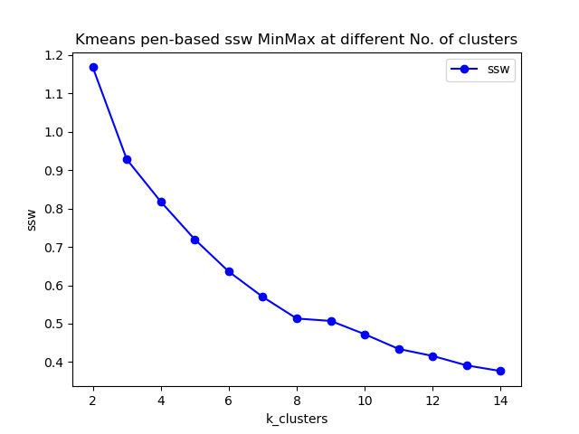
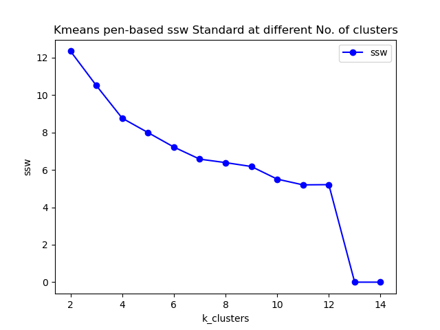
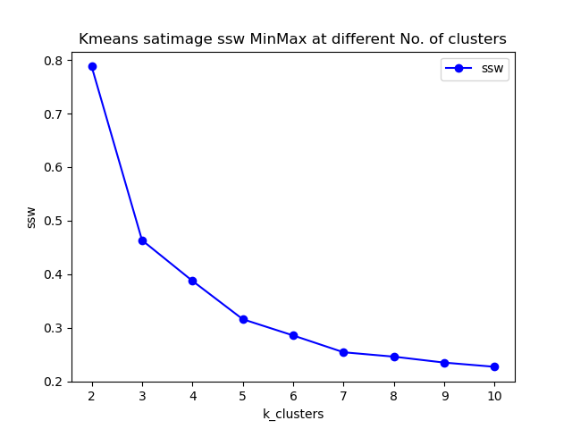
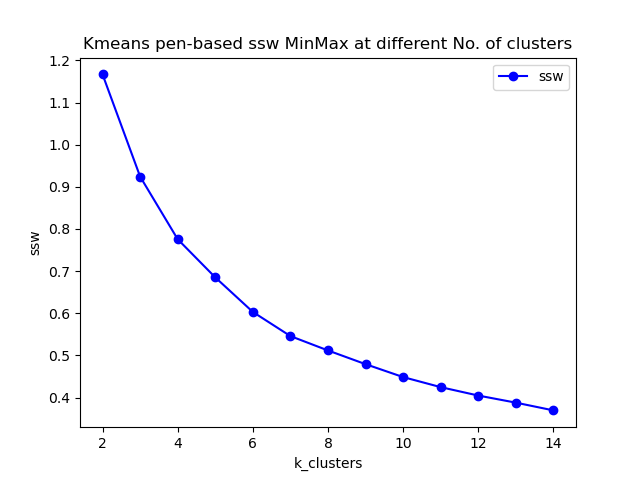
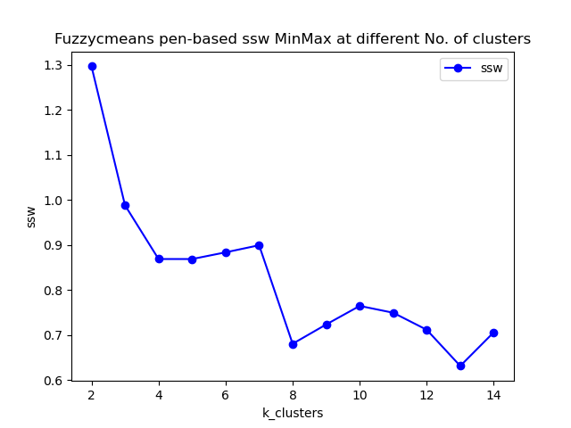
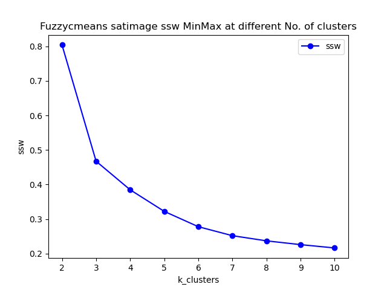

# Clustering Project Report 

* **Student Name:**
**Jeannette Hernamdez**
**Sanan Pashayev**  
**Shanshan Zhang** 

## **Introduction to Clustering**

Cluster analysis is popular unsupervised learning method which divides data into groups (clusters) that are meaningful, useful, or both. If meaningful groups are the goal, then the clusters should capture the natural structure of the data. There are lots of specific clustering techniques in nowadays. 

### **Hierarchical vs Partitional Clustering** 

The most commonly discussed distinction among different types of clustering is whether the set of clusters is nested or unnested, or in more traditional terminology, hierarchical or partitional.  
A partitional clustering is simply a division of the set of data objects into non-overlapping subsets (clusters) such that each data object is in exactly one subset. Whereas Hierarchical methods permit clusters to have sub-clusters, then we obtain a hierarchical clustering, which is a set of nested clusters that are organized as a tree. Each node (cluster) in the tree (except for the leaf nodes) is the union of its children (sub-clusters), and the root of the tree is the cluster containing all the objects.    
Basic approaches for generating a hierarchical clustering includes **bottom-up(agglomerative)** and **top-down(divisive)** methodologies. Agglomerative algorithm starts with each example in its own cluster and iteratively combine them to form larger and larger clusters, while divisive algorithm starts with all the examples in a single cluster, and choose the best division by considering all the possible ways to divide the cluster into two. 

### **Exclusive versus Overlapping versus Fuzzy**

In the most general sense, an overlapping or non-exclusive
clustering is used to reflect the fact that an object can simultaneously belong to more than one group (class). For example, in a fuzzy clustering, every object belongs to every cluster with a membership weight that is between 0 (absolutely doesn’t belong) and 1 (absolutely belongs). In other words, clusters are treated as fuzzy sets. (Mathematically, a fuzzy set is one in which an object belongs to any set with a weight that is between 0 and 1. In fuzzy clustering, we often impose the additional constraint that the sum of the weights for each object must equal 1.)    

### **Different methods to group data**  
We could use different methods to group large sets of data into small sets of clusters of similar data, which including follows:

-  Based on connectivity: Hierarchical clustering
- Based on centroids: K-means
- Distribution-based models: Mixture models, Expectation-Maximization
- Density models: DBScan, Optics
- Subspace models: Biclustering
- Group models 
- Graph-based 

### **Road Map to our algorithms**

we use the following two simple, but important techniques to introduce many of the concepts involved in cluster analysis.   
* **K-means:** []This is a prototype-based, partitional clustering technique that attempts to find a user-specified number of clusters (K), which are represented by their centroids.

* **Fuzzy_c_means:**[@cannon1986efficient] As we have introduced in the earlier chapter, fuzzy clustering is a form of clustering in which each data point can belong to more than one cluster. Similarly, probabilistic clustering techniques compute the probability with which each point belongs to each cluster, and these probabilities must also sum to 1, since a fuzzy or probabilistic clustering does not address true multiclass situations, such as the case of a student employee, where an object belongs to multiple classes.  

* **Comparison in theory:** Fuzzy c-means clustering can be considered a better algorithm compared to the k-Means algorithm. Unlike the k-Means algorithm where the data points exclusively belong to one cluster, in the case of the fuzzy c-means algorithm, the data point can belong to more than one cluster with a likelihood. **Fuzzy c-means clustering gives comparatively better results for overlapped data sets**.

## Data pre-processing 

#### **Dataset Selection**  

Since k means and fuzzy c means algorithms only works on numerical data values, so we choose our datasets among the datasets of which all feature values is numerical. Based on the requirement, we need to analyse the behaviour of different clustering algorithms in well-known data sets from the UCI repository. But after we check dataset information one by one, we found that most of the datasets which have  tens of features together with a limited number of samples. **For machine learning algorithms, we are actually producing meaningful conclusions based a meaningful sample distribution.** As a rough rule of thumb, your model should train on at least an order of magnitude more examples than trainable parameters. Simple models on large data sets generally beat fancy models on small data sets.

So we select two datasets with considerably larger number of samples compared to others - ***pen-based.arff*** and ***satimage.arff***. 

|  Dataset Name   | No. of features  | No. of Sample |  
|  ----  | ----  | ----  |
| pen_base  | 16 | 10992 |
| satimage  | 36 | 6435 |

Even the dataset size for these two datasets is closed to each other, but the satimage data set has more than twice the number of features in pen_base dataset. 

### **Data pre-processing pipeline**
Data pre-processing is a predominant step in machine learning to yield highly accurate and insightful results. Greater the quality of data, the greater is the reliability of the produced results. **Incomplete**, **noisy**, and **inconsistent** data are the inherent nature of real-world datasets. Data pre-processing helps in increasing the quality of data by filling in missing incomplete data, smoothing noise, and resolving inconsistencies.

There are many stages involved in data pre-processing: **1)Data Cleaning**, **2)Data Integration**, **3)Data Transformation**, **4)Data Reduction**.   

* **Data cleaning** attempts to impute missing values, smooth out noise, resolve inconsistencies, removing outliers in the data. We have implement **filling NA and dropping NA, dropping duplicates** in the ***"./dataset/data_preprocessing_numerical.py"*** file.   
* **Data integration** integrates data from a multitude of sources into a single data warehouse. We haven't touched this part in our project, but it is critical procedure for merging data sets from different sources.   
* **Data transformations**, such as normalization, may be applied in some cases. The goal of normalization is to change the values of numeric columns in the dataset to a common scale, without distorting differences in the ranges of values or losing information. There are several ways to perform normalization including **standardisation by Z scores**, **normalized into -1 to 1 range by mean value**,  **scaling value between 0 and 1 with max and min values**, **Scaling values by considering the whole feature vector to be of unit length**.      
* **Data reduction** can reduce the data size by dropping out redundant features. Feature selection and feature extraction techniques can be used. We do not cover this topic in work 1, but we will continue further steps for data pre-processing by using data reduction techniques in work 2.

* One extra step we do for data pre-processing is **shuffling data**. 

* We must notice that the **true labels from raw data is either all text or binary format**. So here we utilize LabelEncoder from sklearn library to **transform target labels into value between 0 and n_classes-1**. 

by running the main function in **"./dataset/data_preprocessing_numerical.py"**, we can successfully load and pre-process datasets into 2 separate pickle file, one with purely numerical features and the other one with labels with integer values. 

## **Algorithm implementation and evaluation**

In this project, we are required to implement the following algorithms:   
1. **OPTICS with sklearn library**
1. **K-Means implemented by our own code)**
1. **Fuzzy c means implemented by our own code)**

### **Optics implementation and evaluation**
Ordering points to identify the clustering structure (OPTICS)[@ankerst1999optics] is an algorithm for finding density-based clusters in spatial data. Its basic idea is similar to DBSCAN, but it addresses one of DBSCAN's major weaknesses: the problem of detecting meaningful clusters in data of varying density. To do so, the points of the database are (linearly) ordered such that spatially closest points become neighbors in the ordering. Additionally, a special distance is stored for each point that represents the density that must be accepted for a cluster so that both points belong to the same cluster. 
OPTICS   


<center style="font-size:14px;color:#C0C0C0;text-decoration:underline">Reachability Plot</center>  

Using a ***reachability-plot*** (a special kind of dendrogram), the hierarchical structure of the clusters can be obtained easily. It is a 2D plot, with the ordering of the points as processed by OPTICS on the x-axis and the reachability distance on the y-axis. Since points belonging to a cluster have a low reachability distance to their nearest neighbor, the clusters show up as valleys in the reachability plot. The deeper the valley, the denser the cluster.

for optics algorithms we can call corresponding API as follow:   
```class sklearn.cluster.OPTICS(*, min_samples=5, max_eps=inf, metric='minkowski', p=2, ...)```

There are two parameters, **max_eps** and **eps** which will be used to determine the maximum distance between two samples for one to be considered as in the neighborhood of the other. Based on our understanding, **the epsilon value in OPTICS is solely to limit the runtime complexity when using index structures..** So we choose to use default value which is np.inf to run our model. Another parameter **min_cluster_size** (to determine minimum number of samples in an OPTICS cluster) for which we do not have enough knowledge to tune, so we keep the default values. The only parameter we tune is  **min_samples**. The selection oft *'min_pts'* does rely on domain knowledge. One intuition to select min_pts is to use ln(n), where n is the total number of points to be clustered, while min_pts = 2dim alsp can be applied, where d is the number of dimensions.

### **Kmeans implementation**

The algorithm for kmeans is iterative which groups the dataset into K pre-defined distinct non-overlapping subgroups (clusters) where each data point belongs to a single specific group. The main objective is to make the intra-cluster vector points as equal as possible while also keeping the clusters as far different as possible. It assigns data points to a cluster such that the sum of the squared distance between the data points and the cluster’s centroid (arithmetic mean of all the data points that belong to that cluster) is at the minimum. The less variation we have within clusters, the more homogeneous (similar) the data points are within the same cluster.  

The way our kmeans algorithm works is as follows:

1. **Training**

    1. Specify number of clusters K.
    2. Initialize kmeans centroids by random selecting each feature value between its minimum and maximum value.
     3. Keep iterating until there is no change to the centroids. i.e assignment of data points to clusters isn’t changing.
        * Compute the sum of the squared distance between data points and all centroids.
        * Assign each data point to the closest cluster (centroid). 
        * Compute the centroids for the clusters by taking the average of all the data points in each cluster.

2.  **Inference**
    1. Compute the sum of the squared distance between data points and all centroids.
    2. Assign each data point to the closest cluster (centroid)


Moreover, since there is **no right answer in terms of the number of clusters** that we should have in any problem, sometimes domain knowledge and intuition may help but usually that is not the case. In this methodology, we decide to evaluate how well the models are performing based on different K clusters by evaluation metrics built by us.  
Our number of clusters setting for kmeans:
1. we use $[2, 3, 4, ..., 15]$ for pen_base dataset to evaluate model performance. 
1. we use $[2, 3, 4, ..., 10]$ for satimage dataset to do the evaluation. 

> **Few things to note here**: Given kmeans iterative nature and the random initialization of centroids at the start of the algorithm, different initializations may lead to different clusters since kmeans algorithm may stuck in a local optimum and may not converge to  global optimum. Therefore, we **average 3 runs of kmeans algorithm on each dataset.**

* **Code Implementation**
Our code implementation including the following components and logic in *models/kmeans.py*: 
    * Compute distance between a sample and certain centriod 
    ```python 
    def distEclud(vecA, vecB):
     return np.sqrt(np.sum(np.power(vecA - vecB, 2)))
    ```  
    * Initialize the cluster centroids 
    * Main Logic of our algorithm. We set clusterChanged flag to check if any sample has changed membership, if $clusterChanged=False$, we will reach the end of training. If not, firstly we calculate minimum distance together with its index for all the samples with all centroids in the upper for loop. Later we calculate centroids positions according to the newly assigned indices (or cluster label) to samples. Finally we return the centroids and training cluster labels. 
     ```python 
        while clusterChanged:
        clusterChanged = False
        for i in range(m):
            minDist = float(math.inf)

            minIndex = -1
            for j in range(k):
                distJI = distMeas(centroids[j,:],dataSet[i,:])
                if distJI < minDist:
                    minDist = distJI
                    minIndex = j

            if clusterAssment[i, 0] != minIndex: clusterChanged = True
            clusterAssment[i, :] = minIndex, minDist**2

        for cent in range(k):
            ptsInClust = dataSet[np.nonzero(clusterAssment[:,0].A == cent)[0]]
            centroids[cent, :] = np.mean(ptsInClust, axis=0)
    return centroids, clusterAssment.A[:, 0]
    ```  

### **Fuzzy c means implementation**
Fuzzy C-Means clustering is a soft clustering approach, where each data point is assigned a likelihood or probability score to belong to that cluster. The cost function of fuzzy c means is defined as below:
$$ J_m = \sum_{i=1}^N \sum_{j=1}^C u_{ij}^m \lVert x_i - c_j \lVert ^2 , {\text{ 1 ≤ m < ∞}}  \tag{1}$$
*where **m** is any real number greater than 1, $u_{ij}$ is the degree of membership of $x_i$ in the cluster $j$, $x_i$ is the ith of d-dimensional measured data, $c_j$ is the d-dimension center of the cluster, and $\lVert * \lVert$ is any norm expressing the similarity between any measured data and the center.*   

The step-wise approaches of the Fuzzy c-means clustering algorithm which are wrapped in fuzzyCMean object in *models/fuzzy_c_means.py* are as follows:
* Firstly initialize the membership values to each cluster, these membership grades indicate the degree to which data points belong to each cluster.

    ```python 
    def initialize_membership_matrix(self):

        self.membership_matrix = self.random_generator.uniform(size=(self.n_samples, self.k_clusters))
        membership_normalizer = self.membership_matrix.sum(axis=1, keepdims=True)
        # normalize into 
        self.membership_matrix = self.membership_matrix / membership_normalizer
    ```  
* Secondly, Compute  the distance between all samples and each centroid

    ```python 
    def _compute_distance(self):
        distances = np.sqrt(np.einsum("ijk->ij", (self.data[:, None, :] - self.centroids)**2))
        return distances
    ```  

*  Update membership matrix according to distances between samples and centroids:
$$ u_{ij} = \frac {1}{\sum_{k=1}^C \left( \frac{ \lVert x_i - c_j \lVert }{\lVert x_i - c_k \lVert} \right)^{\frac{2}{m-1}}} \tag{2}$$  *whereas k are the cluster index.*  
<br/> 

    ```python 
    def update_membership_matrix(self):

        dist_samples_centroid = self._compute_distance()
        dist_samples_centroid = dist_samples_centroid ** float(2/(self.m-1))
        reshape_dist = dist_samples_centroid.reshape((self.data.shape[0], 1, -1)) 
        dist_on_all_centroids = reshape_dist.repeat(reshape_dist.shape[-1], axis=1)
        denominator = dist_samples_centroid[:, :, np.newaxis] / dist_on_all_centroids
        self.membership_matrix = 1 / denominator.sum(2)
    ```  

* Update cluster centers according to obtained membership matrix in last step, With fuzzy c-means, the centroid of a cluster is the mean of all points, weighted by their degree of belonging to the cluster, or, mathematically.
$$c_j = \frac { \sum_{i=1}^N u_{ij} * x_i}{\sum_{i=1}^N u_{ij}^m}$$


    ```python 
    def find_centroids(self):
        """Update cluster centers"""
        u_power_m = self.membership_matrix ** self.m
        numerator = np.dot(self.data.T, u_power_m)
        denominator = u_power_m.sum(axis=0)

        self.centroids = (numerator/denominator)
        self.centroids = self.centroids.T
    ```  
* Training logic is organized in train function, and fuzzy partitioning is carried out through an iterative optimization of the objective function shown above by updating membership matrix and repeatly :
    ```python 
    def train(self):
        self.initialize_membership_matrix()
        for _ in range(self.max_iter):
            old_membership_matrix = self.membership_matrix.copy()
            self.find_centroids()
            self.update_membership_matrix()

            if np.linalg.norm(self.membership_matrix - old_membership_matrix) < self.epsilon:
                break
    ```  
* This iteration will stop when, where **$\epsilon$**  is a termination criterion between 0 and 1, or the maximum iteration steps are reached. This procedure converges to a local minimum or a saddle point of $J_m$.

## Performance evaluation  

The main goal of clustering approaches is to obtain **high intra-cluster similarity** and low **inter-cluster similarity** (objects in the same cluster are more similar than the objects in different clusters). Clustering validation has long been recognized
as one of the vital issues essential to the success of clustering applications. 
In general, **clustering validation can be categorized into two classes, external clustering validation and internal clustering validation.**   

### **Internal clustering validation**

The internal measures evaluate the goodness of a clustering structure without respect to external information [4]. Internal validation measures can be used to choose the best clustering algorithm as well as the optimal cluster number without any additional information. In practice, **external information such as class labels is often not available in many application scenarios. Therefore, in the situation that there is no external information available, internal validation measures are the only option for cluster validation.** 
As the goal of clustering is to make objects within the same cluster similar and objects in different clusters distinct, internal validation measures are often based on the following two criteria:
* **Compactness.** It measures how closely related the objects in a cluster are. A group of measures evaluate cluster compactness based on variance. Lower variance indicates better compactness. 
* **Separation.** It measures how distinct or well-separated
a cluster is from other clusters. For example, the pairwise
distances between cluster centers or the pairwise minimum
distances between objects in different clusters are widely
used as measures of separation. Also, measures based on
density are used in some indices.

#### **SSW** & **SSB**
Minimizing Sum of Squares of the distance from the centroid of the cluster for cluster points within the cluster (SSW) and maximizing Sum of Square distance between the centroids of different clusters (SSB) are two generally used quality parameters of the clustering technique. 

* **SSW** calculation 
$$SSW = \frac{1}{N} \sum_{i=1}^N \lVert x_i - C_{p_i} \lVert \tag{1}$$ where $ i = \{ 1, 2, \ldots, N\}$is the set of clusters and $C_{p_i}$ is corresponding cluster for sample $i$.   

* **SSB** calculation 
$$SSB = \frac{1}{M(M-1)} \sum_{i=1}^M \sum_{j=1,j≠i}^M  \lVert x_i - C_{p_i} \lVert \tag{2}$$  where $ i = \{ 1, 2, \ldots, N\}$is the set of clusters and $C_{p_i}$ is corresponding cluster for sample $i$, and M is number of samples.

#### **Other concerns**

>***One thing to notice: Elbow Method***
>Elbow method gives us an idea on what a good k number of clusters would be based on the sum of squared distance (SSE) between data points and their assigned clusters’ centroids. We pick k at the spot where SSE starts to flatten out and forming an elbow. We’ll use the geyser dataset and evaluate SSE for different values of k and see where the curve might form an elbow and flatten out.

#### **Davies-Bouldin index**
This is an internal evaluation scheme, where the validation of how well the clustering has been done is made using quantities and features inherent to the dataset. This has a drawback that a good value reported by this method does not imply the best information retrieval. 

### **External clustering validation** [@palacio2019evaluation]

#### **Purity** 

An example of external
validation measure is entropy, which evaluates the “purity”
of clusters based on the given class labels [3] 

**Purity** is a simple and transparent evaluation measure, and measures the extent to which a cluster contains objects of a single class. We assign a label to each cluster based on the most frequent class in it. Then the purity becomes the number of correctly matched class and cluster labels divided by the number of total data points.

$$P = \frac{1}{N} \sum_{k} \underset {j}{max} |w_k \bigcap c_j| \tag{1}$$   
where $\Omega = \{ \omega_1, \omega_2, \ldots, \omega_K \}$is the index of index of samples and set of classes. We interpret $\omega_k$ as the set of documents in $\omega_k$ and $c_j$ as the set of documents in $c_j$ in above equation. 

#### **Adjusted Rand Index**
The adjusted Rand index is the corrected-for-chance version of the Rand index.Such a correction for chance establishes a baseline by using the expected similarity of all pair-wise comparisons between clusterings specified by a random model. 

### **K means evaluation** 

#### Program execution 
We implement our K means algorithm exactly like it is shown in kmeans implementation part. 
1. Open <IML_Project> directory, click and run <train_k_means.py>, then the training for kmeans will automatically begins. 
1. To try fully evaluate our algorithm, 3 different normalization method are deployed during evaluation, as discussed in the previous data pre-processing part, are **MinMax**, **Standard**, **Mean** normalization method. By setting **"normalize_method"** with these three values, one can linked to our pre-processed data in pickle format accordingly.  
1. By **setting *data_index* to 0 or 1**, one can choose to train on different dataset **(0 for pen-base and 1 for satimage)**. 
1. We manipulate and storage our data in ***dataset*** directory and visualize all the evaluation results in ***visualization/result_plots*** directory.
1. We implement training and evaluation of **Kmeans algorithm in sklearn** in <golden_kmeans_evaluation.py> file to compare the performance with our own model.

#### Setting Hyperparameters
For the K-means algorithm, we **don't use the *max_iter* parameter**, since we found assignments of data points to clusters usually converged in less than 100 iterations. So, we decide let the algorithm to choose the number of iterations. 
In order to find the best number of clusters, we have **made use of the elbow method** to analyse our evaluation results. Here, we use both the datasets(pen-base and satimage). 

##### Pen-base dataset 
Below images are SSW values obtained on pen-based dataset in 3 different ways of normalization. We could figure out easily the optimal k value(No. of clusters) for pen-based dataset is around 8~13 in our case. Since there are 10 true labels in pen-based, we assume **the 'Mean' and 'MixMax' normalization produce the more meaningful result for applying Elbow method than 'Standard'** which looks abonarmal in bottom right corner. 




Values for all metrics are summarized as follows with respecet  the best k value in each normalization method, where DBI for davies bouldin score and ARI for adjusted rand score. 

|  Normalization | Purity | SSW | DBI | ARI | Best k |  
|  ----  | ----  | ----  | ----  | ----  | ----  |----  |
| MinMax  | 0.6388  | 0.5134 |1.2711 |0.4177 | 8 |
| Mean  | 0.7221 | 5.7791 | 1.4065 |0.5549 | 10 |

##### Satimage dataset
Below images are SSW values obtained on satimage dataset in 3 different ways of normalization. We could figure out easily the optimal k value(No. of clusters) for satimage dataset is 5~7. Since there 6 true classifications in satimage, we can savely conclude that **Kmeans performs better on satimage than pen with the fact that satimage contain more than twice of the numbers of features than pen-based.** 

.
.
.

|  Normalization | Purity | SSW | DBI | ARI | Best k |  
|  ----  | ----  | ----  | ----  | ----  | ----  |----  |
| MinMax  | 0.7690  | 0.2544 |1.1252 |0.5376 | 7 |
| Standard  | 0.7159 | 9.0290 | 1.1185 |0.5042 |5 |
| Mean  | 0.7174 | 8.0363 | 1.0514 | 0.5077 | 6 |

##### Performance of Kmeans method in Sklearn 
We can see from the above part, we do not quite meaning adjust rand score which measures the similarity between our predicted cluster labels and true label.  
Like figure below, but sklearn kmeans it elbow point appears at 6 which is identical in all normalization methods.

.

And the average purity and ARI under the condition of 6 clusters is and $0.5284$ and $0.7413$ , which are quite like what we got from our model. We also try the sklearn model in pen-basad dataset, and the conditions for purity and ARI score are much like we got in satimage, but it does perform consistently in the 3 normalizations when applying elbow method.

.

### **Fuzzy c means evaluation result** 
We implement our fuzzy c means algorithm exactly like it is shown in the implementation part. 
1. Open <IML_Project> directory, click and run <train_fuzzy_c_means.py>, then the training for kmeans will automatically begins. 
1. To try fully evaluate our algorithm, 3 different normalization method are deployed during evaluation, as discussed in the previous data pre-processing part, are **MinMax**, **Standard**, **Mean** normalization method. By setting **"normalize_method"** with these three values, one can linked to our pre-processed data in pickle format accordingly.  
1. By **setting *data_index* to 0 or 1**, one can choose to train on different dataset **(0 for pen-base and 1 for satimage)**. 
1. We manipulate and storage our data in ***dataset*** directory and visualize all the evaluation results in ***visualization/result_plots*** directory.
1. We implement training and evaluation of **fuzzy-c-means package in PyPI** in <golden_kmeans_evaluation.py> file to compare the performance with our own model. 

#### Setting Hyperparameters
For the Fuzzy c means algorithm, we **don't use the *max_iter* parameter**, since we found assignments of data points to clusters usually converged in less than 100 iterations.
There are other two parameters we can work on further in project 2, which are **m** defined in the cost function, and **epsilon** which is used to as the termination threshold.
During our training, we have tried $1e-5$ , $1e-7$ and $1e-9$ and found training time did not change too much, especially for small number of clusters. So we choose to**use $1e-9$ in our code**.  
In order to find the best number of clusters, we have **made use of the elbow method** to analyse our evaluation results. Here, we use both the datasets(pen-base and satimage). 

##### Pen-base dataset 
Below images are SSW values obtained on pen-based dataset in 3 different ways of normalization. We could figure out **the 'MixMax' normalization produce the most meaningful result than other method**. Other two SSW curves keep bouncing up and down when increasing k values. 

But even in this 'MixMax', **we have not got neat elbow points in the graph**, and we also get lower purity, DBI and ARI compared to Kmeans model. **We conclude that Kmeans outperforms fuzzy c means on pen-based dataset.** 


Values for all metrics are summarized as follows with respect  the best k value in each normalization method, where DBI for davies bouldin score and ARI for adjusted rand score. 

|  Normalization | Purity | SSW | DBI | ARI | Best k |  
|  ----  | ----  | ----  | ----  | ----  | ----  |----  |
| MinMax  | 0.5636  | 0.6810 | 1.3359 |0.4179 | 8 |

##### Satimage dataset 
Below images are SSW values obtained on satimage dataset in 3 different ways of normalization. We could figure out easily the optimal k value(No. of clusters) for satimage dataset is 5~7. Since there 6 true classifications in satimage, we can savely conclude that **Kmeans performs better on satimage than pen with the fact that satimage contain more than twice of the numbers of features than pen-based.** 

.
.
.

|  Normalization | Purity | SSW | DBI | ARI | Best k |  
|  ----  | ----  | ----  | ----  | ----  | ----  |----  |
| MinMax  | 0.7412 | 0.2781 |1.0594 |0.0.5343 | 6 |
| Standard  | 0.7419 | 7.7801 | 1.0353 |0.5332 |6 |
| Mean  | 00.7419 | 7.7801 | 1.0353 |0.5332 |6 |

With respect to all the metrics, **we believe Kmeans and fuzzy c means nearly get the same performance for satimage dataset.** And for both cases, we can get neat elbow points, so we believe **the features in satimage is more effective for clustering**.

|  Normalization | Purity | SSW | DBI | ARI | Best k |  
|  ----  | ----  | ----  | ----  | ----  | ----  |----  |
| MinMax  | 0.5636  | 0.6810 | 1.3359 |0.4179 | 8 |

##### Performance of FCM in PyPI 
We can see from the above part, we do not quite meaning adjust rand score which measures the similarity between our predicted cluster labels and true label. But when we check with the performance of FCM package from python libraries, surprisingly, we have gotten even worse 
adjust rand score which is lower than our fuzzy model.
Like figure below, but FCM  it elbow point appears at 6 which is identical in all normalization methods.
.

And the purity DBI and ARI under the condition of 6 clusters is showing in the below table, which are quite like what we got from our model. We also try the FCM in pen-basad dataset, and the conditions for purity and ARI score are even much low than ours, but it does perform consistently when applying elbow method.


## Conclusion 
1. With respect to DBI, ARI, and purity score, both of our algorithms perform equally compared to the original library in sklearn and Python.
1. When applying elbow method to select the best k value, in some cases we got neat elbow points and but we did got trouble when applying elbow method for pen-based dataset on fuzzy c means. While sklearn and python package perform very well on this.
1. Kmeans gets a overall better performance on our two datasets, which contradicts our intuition a lot. Since initially we believe soft partition methods will wins. Here we assume the fuzzy method does is a promising strategies for overlapping clusters but maybe not always powerful for samples which can only be assigned to single cluster.
1. For satimage dataset, there is not much difference on performance on different algorithms and different normalization methods. But for pen-based algorithms, the performance of algorithms is much sensitive to normalization. 'MinMix' seem like the best normalization to apply when training on fuzzy c means model 
1. For the best k values:
    * pen-based dataset: 
        * Kmeans: 10 
        * Fuzzy c menas: 8 
    * satimage dataset:
        * Kmeans: 6
        * Fuzzy c means: 6 
2. For the metrics we have applied in this project, we have found fuzzy c means might be much more sensitive to different normalization approaches, and much more sensitive to different datasets compared to Kmeans. 

## Reference
[1] Ankerst, Mihael, Markus M Breunig, Hans-Peter Kriegel, and Jörg Sander. 1999. “OPTICS: Ordering Points to Identify the Clustering Structure.” ACM Sigmod Record 28 (2): 49–60.
[2] Cannon, Robert L, Jitendra V Dave, and James C Bezdek. 1986. “Efficient Implementation of the Fuzzy c-Means Clustering Algorithms.” IEEE Transactions on Pattern Analysis and Machine Intelligence, no. 2: 248–55.
[3] Liu, Yanchi, Zhongmou Li, Hui Xiong, Xuedong Gao, and Junjie Wu. 2010. “Understanding of Internal Clustering Validation Measures.” In 2010 IEEE International Conference on Data Mining, 911–16. IEEE.
[4] lacio-Niño, Julio-Omar, and Fernando Berzal. 2019. “Evaluation Metrics for Unsupervised Learning Algorithms.” arXiv Preprint arXiv:1905.05667.

